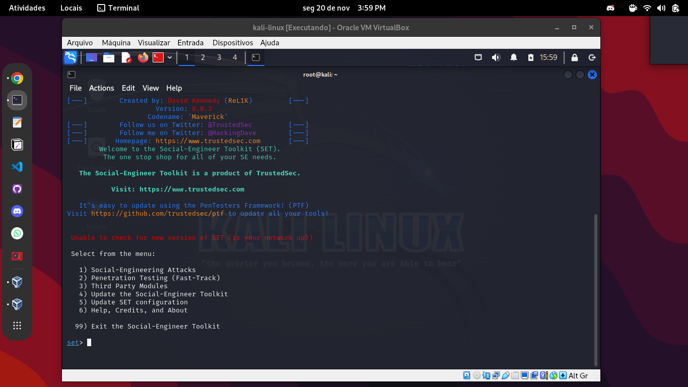
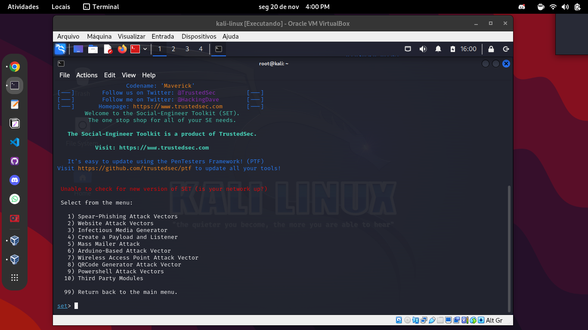
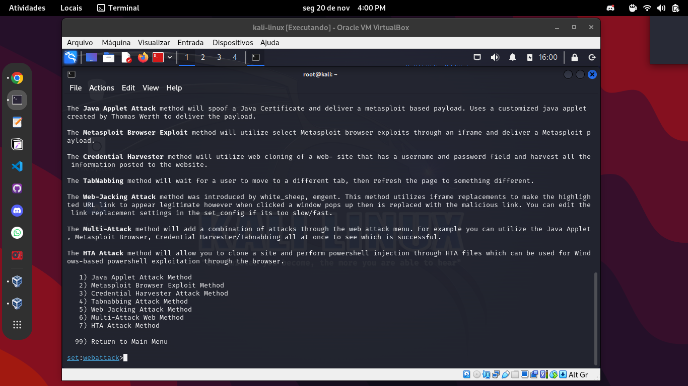
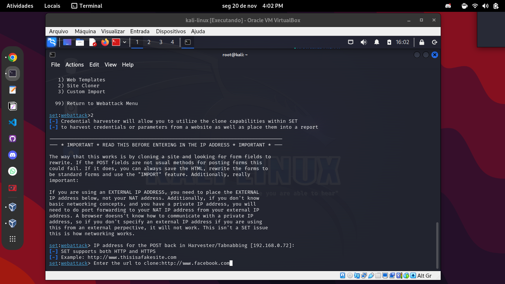
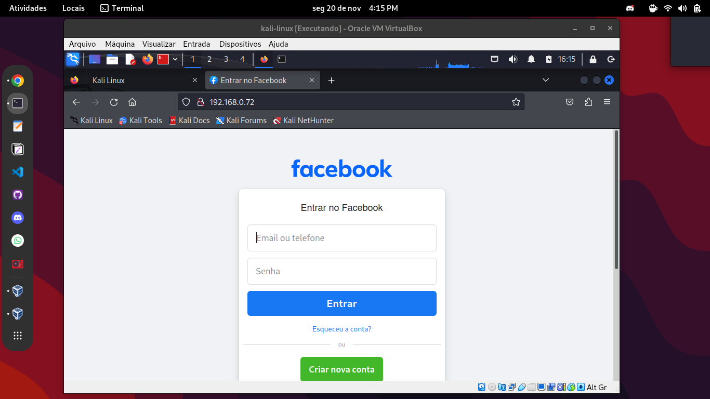

# Phishing com Kali Linux/setoolkit

## Passo 1:

Abra seu terminal como root e execute o seguinte comando:

```bash
$ setoolkit
```
Selecione a primeira opção na tela que será exibida, "Social-Engineering Attacks".


## Passo 2:

Selecione a segunda opção, "Website Attack Vectors".



## Passo 3:

Selecione a terceira opção, "Credential Harvester Attack Method".



## Passo 4:

Selecione a segunda opção, "Site Cloner".


Essa opção nos permite criar uma fakepage estática de uma página de login qualquer e rodar em um servidor particular. Caso a pessoa preencha os dados do formulário falso, vamos receber os valores através do método Post e redirecionar a pessoa para a página original na qual ela estava tentando acessar (página clonada).

## Passo 5:

Nesta etapa, é preciso informar o IP hospedeiro da página fake informar e o site a ser clonado via protocolo HTTP.



O pŕoprio setoolkit já sugere o ip do host no momento da seleção da ferramenta Site Cloner.

## Passo 6:

Agora, ao inserirmos o IP na barra de endereços do navegador será exibida uma versão falsa da página clonada. Depois de preecher o formulário e submeter, a pessoa será redirecionada ao site original e poderemos ter acesso aos dados inseridos no formulário.    

