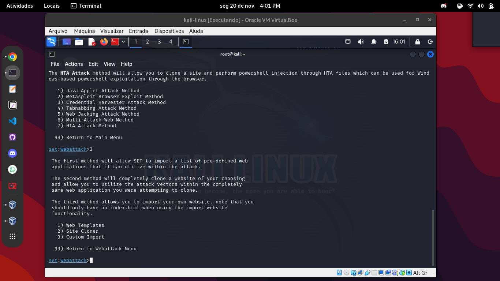
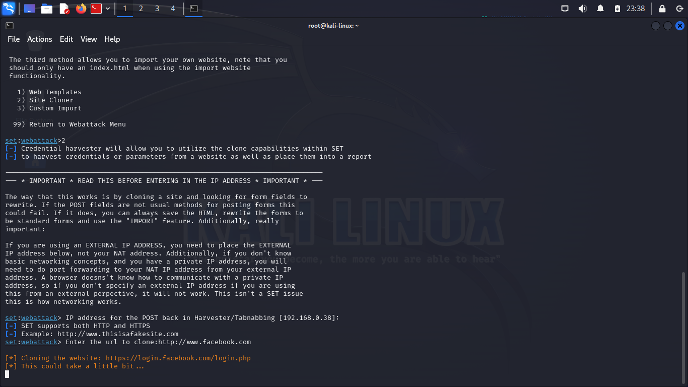

# Phishing com Kali Linux/setoolkit e apache2 server

## Configurações:
Antes de iniciar o setoolkit, precisamos realizar algumas configurações para utilizá-lo com o apache2. Por default, as configurações do setoolkit ficam no arquivo set.config no path -> /etc/setoolkit/set.config/ .

imagem

Vamos abrir o arquivo com um editor de texto e editar as linhas circuladas na imagem, deixando da forma como estão exibidas neste exemplo:

imagem

OBS: Caso você tenha definido outro diretório raiz para o Apache que não seja o padrão, acrescente esse path no lugar do caminho /var/www/html/ .

### Porque utilizar o apache2 ?

Como informado no arquivo de configuração do próprio setoolkit, a utilização do apache2 aumenta a performance do vetor de ataque quando utilizado no lugar do web server default, que é o Python Web Server.

imagem

# Vamos começar!

## Passo 1:

Com as seguintes configurações realizada, abra seu terminal como root e execute o seguinte comando:

```zsh
$ setoolkit
```
Selecione a primeira opção na tela que será exibida, "Social-Engineering Attacks".


## Passo 2:

Selecione a segunda opção, "Website Attack Vectors".


## Passo 3:

Selecione a terceira opção, "Credential Harvester Attack Method".


## Passo 4:

Selecione a segunda opção, "Site Cloner".



Essa opção nos permite criar uma fakepage estática, clonando uma página de formulário POST qualquer e rodando em um servidor particular. Caso a pessoa preencha os dados do formulário falso, vamos receber os valores e redirecionar a pessoa para a página original na qual ela estava tentando acessar (página clonada).

## Passo 5:

Nesta etapa, é preciso informar o IP hospedeiro da página fake e o site a ser clonado via protocolo HTTP. O pŕoprio setoolkit já sugere o ip do host no momento da seleção da ferramenta Site Cloner.



## Passo 6:

Agora, ao inserirmos o IP na barra de endereços do navegador será exibida uma versão falsa da página clonada. Depois de preecher o formulário e submeter, a pessoa será redirecionada ao site original e poderemos ter acesso aos dados inseridos no formulário.    


## Resultado:

No terminal, na janela do setoolkit, serão exibidos os valores inseridos pela pessoa no formulário. Use a ferramenta com sabedoria!    

